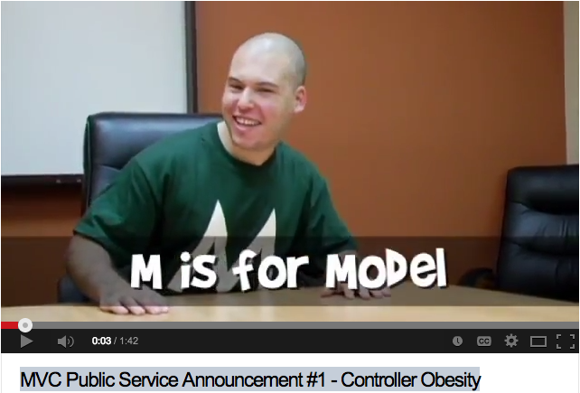

# Exploring the Model 

## Taking another look at the controller

### The role of the controller in the MVC stack

### A controller with its concerns breached

## Separation of concerns

## The role of the model in the MVC stack 

### Moving code from the controller into the model

## Specifying model functionality with RSpec

## Implementing model functionality

## Changing model functionality

### Migrations
